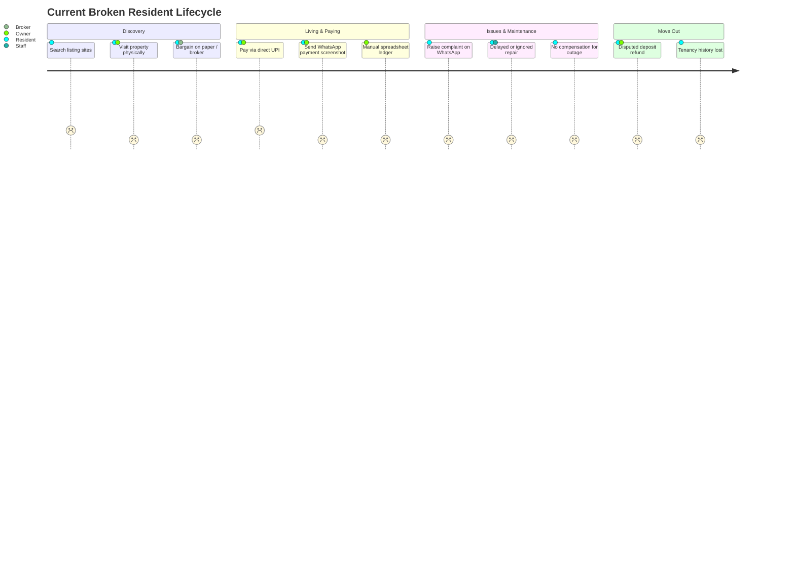
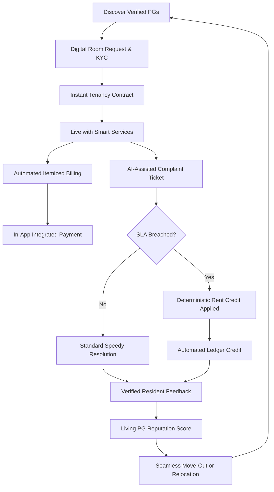
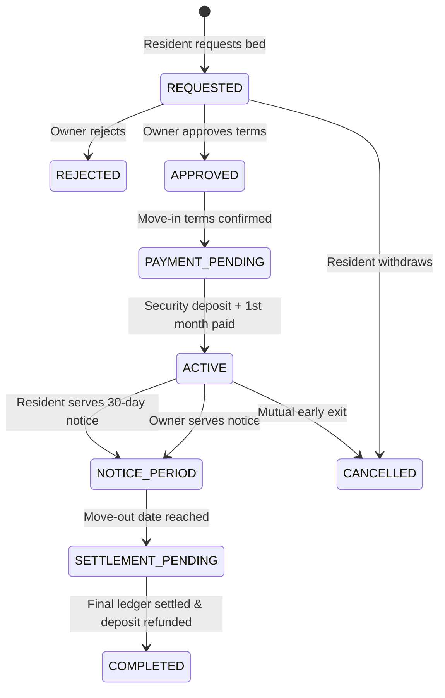
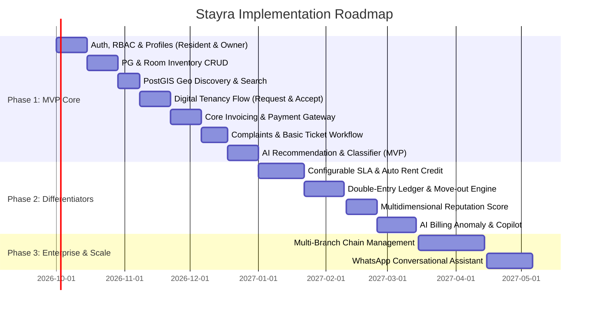

# Stayra — Product Requirements Document (PRD)

**Product Name:** Stayra  
**Tagline:** *Smart stays. Fair rent. Better living.*  
**Product Type:** AI-Native Accommodation & Living Ecosystem  
**Target Audience:** Residents (Tenants), PG & Hostel Owners, Property Operations Staff, Platform Administrators  
**Initial Platforms:** Mobile Apps (iOS & Android via React Native / Expo)  
**Expansion Platforms:** Web Owner Dashboard & Platform Admin Console  
**Document Version:** 1.0.0  
**Status:** Approved & Ready for Technical Implementation  

---

## Executive Summary

The Paying Guest (PG) and student/young-professional housing market in India and Southeast Asia represents a multi-billion dollar sector plagued by high fragmentation, zero transparency, manual paper/spreadsheet tracking, unaccountable maintenance, and recurring financial disputes over rent, hidden charges, and withheld security deposits.

**Stayra** disrupts this broken paradigm by shifting the focus from a transactional "classified listing site" to an end-to-end **Living Ecosystem**. Stayra automates digital tenancy, monthly rent calculation with utility metering, transparent SLA-backed complaint resolution, dynamic PG reputation scoring, and **Service-Level-Based Rent Compensation**—all unified under a persistent **Stayra Resident ID** and powered by specialized AI agents operating under deterministic safety guardrails.

---

## 1. Problem Statement & Market Opportunity

### 1.1 The Fragmented Resident Journey
Today, discovering and residing in a PG involves a disconnected, high-friction chain:
1. **Unverified Discovery:** Outdated photos, deceptive amenities, bait-and-switch pricing on listing portals, manual WhatsApp inquiries, and broker commissions.
2. **Friction-Ridden Onboarding:** Paper KYC forms, unrecorded physical security deposits, undefined verbal terms, and lack of signed tenancy contracts.
3. **Chaotic Living Experience:** Informal WhatsApp complaints that are ignored or forgotten, unmonitored utility bills, arbitrary electricity sub-meter charges, and unpredictable food quality.
4. **Disputed Move-Outs:** Arbitrary deductions from deposits, lack of standardized itemized invoices, zero accountability for prolonged service outages (WiFi down for weeks, broken geysers/ACs), and loss of tenancy history when moving to a new PG.



### 1.2 The Overburdened PG Owner Journey
Owners of single or multi-branch PGs operate without modern enterprise tooling:
- **Manual Bookkeeping:** Scattered WhatsApp payment proofs, cash collections, and Excel spreadsheets lead to payment leakages and reconciliation nightmares.
- **Maintenance Chaos:** Difficulty tracking which staff member attended which room; recurring maintenance problems (e.g., plumbing leaks) go undetected.
- **Tenant Turnover & Vacancy:** High churn due to unresolved dissatisfaction; inability to predict vacant beds or optimize pricing.
- **Reputation Black Hole:** Public Google reviews can be brigaded or falsified, while genuine improvements go unmeasured.

---

## 2. Product Vision & Core Philosophy

> **"Your stay should be easy to find, easy to manage, and fair to pay for."**

Stayra connects service quality directly to financial accountability. A PG is not rated merely by static star reviews; its **complaints, resolution speed, SLA compliance, resident feedback, and automatic service credits** combine into a living, transparent reputation score.

### 2.1 The Stayra Closed-Loop Ecosystem



---

## 3. User Personas & Role-Based Access Control (RBAC)

Stayra enforces strict Role-Based Access Control (RBAC) and data isolation across four primary roles:

| Role | Key Objectives | Critical Permissions |
|---|---|---|
| **Resident** | Find accommodations, digitally sign contracts, pay itemized bills, lodge media-rich complaints, receive rent compensation, rate verified stays. | View public PGs, manage own tenancy, view own ledger/invoices, create complaints for own room, submit feedback post-resolution. |
| **PG Owner** | Maximize occupancy, automate monthly rent generation, track ledger balances, assign staff to complaints, configure SLAs and compensation policies. | Full CRUD on owned properties, rooms, pricing, rules, and staff assignments; approve/reject room requests; issue manual ledger adjustments; view operational analytics. |
| **PG Staff** | Resolve maintenance tickets promptly, update task progress, log resolution proofs (photos/notes). | View tickets assigned to their PG/specialization, update ticket status, upload resolution proof. No access to financial ledgers or owner revenue metrics. |
| **Platform Admin** | Ensure platform integrity, verify PG ownership and licenses, audit KYC, adjudicate escrow/payment disputes, monitor fraud. | System-wide view, PG verification approvals, override SLA disputes, user suspension, global financial audit logs. |

---

## 4. Key Functional Modules

### 4.1 Identity, Authentication & Persistent Stayra Resident ID

1. **Multi-Channel Authentication:**
   - Phone Number + OTP (primary mobile auth for India/APAC).
   - Social logins (Google OAuth 2.0, Apple Sign-In).
   - JWT tokens (Short-lived Access Token: 15 min, Rotating Refresh Token: 30 days stored in SecureStore/Keychain).
   - Device and session management with remote revocation.

2. **Persistent Stayra Resident ID:**
   - Every resident receives a globally unique, immutable ID: `STR-RES-XXXXXX`.
   - The resident profile persists across PG moves. A resident's lifetime rating, verified KYC status, and payment reliability score follow them.
   - **Privacy Boundary (Data Minimization):** An owner of PG A cannot see where the resident moves next (PG B), nor their previous detailed complaint texts from other owners' properties. Only aggregate reliability flags (e.g., "Verified Resident", "100% On-Time Rent Payer") are shared during tenancy requests.

3. **Digital KYC Verification:**
   - Government ID upload (Aadhaar / Passport / Driving License / PAN) stored encrypted in S3 with presigned short-lived access.
   - Owner access to KYC is strictly read-only for active or approved tenancies, complying with local tenancy registration laws.

---

### 4.2 Property & Room Inventory Management

1. **Hierarchical Property Model:**
   - **Property (PG):** Name, address, coordinates (`latitude`, `longitude`, PostGIS Point), rules, amenities, food menus, bank accounts for payout.
   - **Floors & Wings:** Logical grouping for maintenance routing.
   - **Rooms:** Room number, room type (Single, Double, Triple, Four-sharing, Dormitory), attached bathroom (Y/N), balcony (Y/N), air conditioning (Y/N), base rent per bed.
   - **Beds:** Bed identifiers (`Room 204 - Bed B`), availability status (`VACANT`, `OCCUPIED`, `MAINTENANCE`, `RESERVED`).

2. **Verified vs. Owner-Provided Information:**
   - Listings explicitly tag information into two tiers:
     - **Owner Declared:** e.g., "High-speed 200 Mbps WiFi", "Daily Housekeeping".
     - **Resident Verified:** Derived from aggregate ratings and ticket history (e.g., "WiFi verified 180 Mbps average", "Housekeeping SLA adherence: 94%").

3. **Facility & Rule Configuration:**
   - Structured amenity tags: WiFi, In-house Gym, Washing Machine, Power Backup, RO Drinking Water, CCTV, Biometric Entry, Elevators.
   - Standardized house rules: Curfew timings, Guest policies, Smoking/Drinking rules, Pet policies, Food cooking rules.
   - Daily food schedules: Breakfast, Lunch, High Tea, Dinner menus with Veg/Non-Veg/Jain tagging.

---

### 4.3 Discovery, Search & AI Recommendation Agent

1. **High-Performance Geospatial Search:**
   - PostGIS radius and bounding-box queries: "Find PGs within 3 km of DLF Cyber City, Gurgaon".
   - Rich multi-facet filtering: Budget range (₹5,000 – ₹30,000), room sharing type, AC/Non-AC, food availability, curfew flexibility.

2. **AI Recommendation Agent (Natural Language Search):**
   - Residents can search conversationally:
     > *"I need a double-sharing room in HSR Layout Sector 4 under ₹12,000 with high-speed WiFi, vegetarian food, and no strict night curfew because I work night shifts."*
   - **Structured Intent Extraction:**
     ```json
     {
       "location": "HSR Layout Sector 4",
       "max_budget": 12000,
       "sharing_type": "DOUBLE",
       "required_amenities": ["WIFI"],
       "food_preference": "VEGETARIAN",
       "curfew_filter": "FLEXIBLE_OR_NONE"
     }
     ```
   - **Multi-Factor Ranking Algorithm:**
     $$\text{Rank Score} = w_1 \cdot P + w_2 \cdot D + w_3 \cdot R + w_4 \cdot A + w_5 \cdot S_{sla} + w_6 \cdot U$$
     - Price Affordability ($P$): 25%
     - Geographic Distance ($D$): 20%
     - Overall Resident Rating ($R$): 15%
     - Facility Match ($A$): 15%
     - Historic SLA Compliance ($S_{sla}$): 10%
     - Availability Match ($U$): 5%
     - Personalized Preferences ($w_6 \cdot U$): 10%

---

### 4.4 Digital Tenancy Lifecycle



1. **Digital Tenancy Agreement:**
   - Auto-generated digital contract containing: Resident details, PG details, allocated bed, monthly base rent, security deposit, notice period (default 30 days), billing cycle date (e.g., 1st of every month), and agreed house rules.
   - Immutable PDF stored on S3 with digital signature/hash timestamp.

2. **Move-Out & Deposit Settlement Engine:**
   - Settlement calculation performed deterministically:
     $$\text{Refund Amount} = \text{Deposit Paid} - \text{Pending Rent} - \text{Unbilled Utilities} - \text{Approved Damages} + \text{Unapplied Service Credits}$$
   - Both parties review the itemized move-out statement before final bank disbursement.

---

### 4.5 Rent Automation & Immutable Financial Ledger

1. **Automated Monthly Billing Cycle:**
   - On the configured billing trigger date (e.g., 25th of month for next month's invoice, or 1st for current month):
     - Load active tenancy base rent.
     - Ingest variable utility charges (sub-meter electricity units $\times$ per-unit rate).
     - Add fixed amenity/food charges.
     - **Subtract all accumulated Service Compensation Credits.**
     - Compute net payable.
     - Issue digital invoice with automated push notification & WhatsApp invoice link.

2. **Double-Entry Financial Ledger Architecture:**
   - In-app balances are never stored as mutable single numbers.
   - All transactions are recorded as immutable debit/credit entries in a double-entry ledger table:
     - `RENT_CHARGE` (Debit Resident, Credit Owner)
     - `UTILITY_ELECTRICITY` (Debit Resident, Credit Owner)
     - `SERVICE_COMPENSATION_CREDIT` (Credit Resident, Debit Owner)
     - `PAYMENT_RECEIVED` (Credit Resident, Debit Payment Escrow)
     - `DEPOSIT_REFUND` (Debit Owner Escrow, Credit Resident)
   - Every ledger transaction requires an idempotent key (`idempotency_key`) to prevent double-billing on network retries.

3. **AI Billing Anomaly Agent:**
   - Scans generated draft bills before final publication:
     - Detects sub-meter utility spikes (e.g., *"Electricity charge for Room 102 jumped 320% from 3-month average of ₹850 to ₹3,600. Please verify meter photo before sending."*).
     - Flags duplicate line items or unapplied credit rollovers.
     - Guardrail: The AI cannot modify ledger numbers directly; it flags anomalies and creates a review task for the owner.

---

### 4.6 Complaint Management & SLA Tracking

1. **Multi-Modal Complaint Creation:**
   - Category selection: Water Supply, Electricity, WiFi/Internet, Air Conditioning, Food Quality, Housekeeping/Cleaning, Plumbing, Security/Appliance, Staff Behavior, Other.
   - Media attachments: Photos, short video clips, or audio notes showing the fault.
   - Room or common area tag.

2. **AI Complaint Classification Agent:**
   - Converts unstructured resident text/voice into prioritized tickets:
     > *"The geyser in bathroom 302 made a spark sound and tripped the MCB, now there's no hot water and the switchboard smells burnt."*
   - **Classification Output:**
     - Category: `ELECTRICITY`
     - Subcategory: `GEYSER_SHORT_CIRCUIT`
     - Severity: `CRITICAL`
     - Hazard Flag: `FIRE_RISK`
     - Configured SLA: `2 Hours`
     - Auto-assignment: Assigned to designated PG Electrician with urgent SMS/Push alert.

3. **Configurable Property SLA Matrix:**
   Owners set explicit SLAs. Recommended baseline defaults:

| Issue Category | Severity | Default Resolution SLA | Escalation Threshold |
|---|---|---|---|
| Complete Power / MCB Outage | Critical | 4 Hours | 2 Hours |
| Water Supply Outage | Critical | 4 Hours | 2 Hours |
| Geyser / Water Heater Broken | High | 12 Hours | 6 Hours |
| WiFi / Internet Outage | Medium | 24 Hours | 12 Hours |
| AC Breakdown (Summer months) | High | 24 Hours | 12 Hours |
| Room Cleaning / Housekeeping | Low | 12 Hours | 8 Hours |
| Minor Carpentry / Plumbing | Low | 48 Hours | 24 Hours |

---

### 4.7 Service-Level-Based Rent Compensation Engine

This is Stayra's flagship core differentiator: **Direct financial accountability for service quality.**

1. **Predefined Owner Compensation Policies:**
   Owners publish transparent, contractually backed credit terms:
   - *Example Policy:* If WiFi outage exceeds 24 hours, resident receives ₹100 per day of continuous outage.
   - *Example Policy:* If room AC is down for $>48$ hours during peak months (April–July), resident receives ₹200 per day.
   - *Example Policy:* If water supply is unavailable for $>12$ hours, resident receives a flat ₹300 credit.

2. **Deterministic Credit Calculation Workflow:**
   ```mermaid
   sequenceDiagram
       autonumber
       actor Resident
       participant App as Stayra Mobile
       participant API as Stayra Core Backend
       participant Worker as BullMQ SLA Monitor
       participant Ledger as Financial Ledger

       Resident->>App: Raises Complaint (WiFi Down) at 10:00 AM Day 1
       App->>API: POST /complaints (Category: WIFI, SLA: 24h)
       API->>Worker: Schedule SLA Breach Check at 10:00 AM Day 2
       Note over Worker: Background worker runs every 15 min
       Worker->>API: Check ticket status at 10:01 AM Day 2
       alt Ticket Still OPEN / UNRESOLVED
           Worker->>API: Trigger SLA_BREACHED Event
           API->>API: Evaluate Policy (Compensation: ₹100/day)
           API->>Ledger: Issue Pending Compensation Credit (₹100)
           API->>Resident: Push Notification: "SLA breached. ₹100 credit applied to next bill."
       else Ticket Resolved within SLA
           Worker->>API: Mark SLA_SATISFIED (No financial penalty)
       end
   ```

3. **AI Compensation Agent Guardrails:**
   - The AI assists in verifying evidence (e.g., checks if resident marked resolved, checks staff resolution photo), but **all monetary debits/credits are computed by pure, deterministic TypeScript business logic**, never by raw LLM generation.

---

### 4.8 Verified Resident Feedback & Dynamic PG Reputation

1. **Post-Resolution Experience Loop:**
   - Every closed ticket prompts the resident with a 60-second micro-survey:
     - Resolution speed (1–5)
     - Staff professionalism (1–5)
     - Was the problem fully solved? (Yes/No)
   - Verified Monthly Tenancy Review: Residents rate Food, Cleanliness, Safety, and WiFi on the 15th of each month.

2. **Multidimensional Reputation Score (0.0 – 5.0):**
   Instead of a static star rating, Stayra displays an interactive breakdown:
   - **Cleanliness Index:** Calculated from cleaning tickets & monthly ratings.
   - **Food Quality Index:** Calculated from dining feedback.
   - **Maintenance Responsiveness:** Average ticket resolution hours.
   - **SLA Reliability Percentage:** Percentage of tickets closed without breach (e.g., 94.2%).
   - **Compensation Honor Rate:** 100% transparent display of credits honored.

---

### 4.9 AI Owner Management Agent & Operational Analytics

1. **Natural Language Owner Copilot:**
   - Owners can query their portfolio:
     - *"What is my occupancy for next month across Koramangala properties?"*
     - *"Show me my top 3 recurring maintenance complaints this quarter."*
     - *"Are there any unpaid rent balances exceeding 7 days?"*
2. **Proactive Diagnostics:**
   - Detects recurring hardware failures (e.g., *"Block B Room 201 has logged 4 AC cooling complaints in 30 days. Recommend replacing the compressor rather than recharging gas."*).

---

## 5. Non-Functional Requirements (NFRs)

### 5.1 Performance & Latency
- **API Response Times:** 95th percentile ($P_{95}$) under 150 ms for standard CRUD and search endpoints.
- **Geospatial Queries:** PostGIS radius queries under 50 ms for up to 50,000 listed properties with spatial indexing (`GIST`).
- **AI Agent Response:** Streaming tokens within 600 ms; full tool-execution response within 3.5 seconds.
- **Mobile App Launch:** Cold start under 1.8 seconds on mid-tier Android and iOS devices.

### 5.2 Security & Compliance
- **Authentication:** Standard JWT with cryptographic signing (RS256 or HS256 with strong secrets).
- **Transport Security:** Strict HTTPS / TLS 1.3 for all client-to-server communications.
- **Data at Rest:** AES-256 encryption for PostgreSQL database and S3 buckets.
- **Financial Integrity:** Complete audit trails with immutable append-only ledger entries; client cannot submit price or credit overrides.
- **Data Privacy:** PII data masking (phone numbers, national IDs masked in standard staff-facing views).

### 5.3 Reliability & High Availability
- **Target Uptime:** 99.9% availability for core tenant and billing systems.
- **Background Job Durability:** BullMQ workers backed by persistent Redis with auto-retry, dead-letter queues (DLQ), and alerting on job failures.
- **Idempotent Webhooks:** Payment gateway webhooks must be verified via HMAC-SHA256 signatures and processed idempotently via unique transaction IDs.

---

## 6. Implementation Phasing & MVP Scope



### Phase 1: Minimum Viable Product (MVP) Deliverables
1. **Resident App:** Phone OTP Login, Map & List PG Search, PG Details View, Room Request, Active Tenancy Card, Pay Rent via Razorpay/Stripe, Raise Complaint with Photo, Star Rating.
2. **Owner Mobile/Web App:** Property & Room Setup, Bed Allocation, Request Approval, Draft Bill Generation, Payment Dashboard, Complaint Status Updates.
3. **AI MVP:**
   - Natural Language PG Recommendation Agent.
   - Complaint Classification & Priority Triage Agent.
   - Billing Anomaly Detector.

---

## 7. Product Success & North Star Metrics

| Category | Metric | Target (First 6 Months) |
|---|---|---|
| **North Star** | **Successful Stays** (Tenancy initiated, on-time rent paid, zero unresolved SLA breaches) | $> 85\%$ of all active tenancies |
| Resident | Search to Room-Request Conversion Rate | $> 12\%$ |
| Operational | Average Complaint Resolution Time | $< 18 \text{ hours}$ across all categories |
| SLA Quality | SLA Breach Rate | $< 7\%$ of total tickets |
| Financial | In-App Rent Collection On-Time Rate | $> 92\%$ by 5th of every month |
| AI Performance| Ticket Classification Accuracy | $> 94\%$ agreement with human supervisor |
