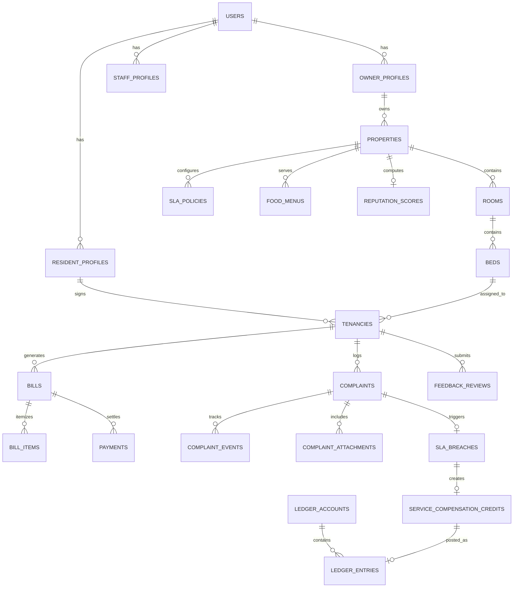
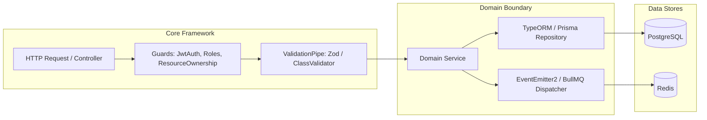
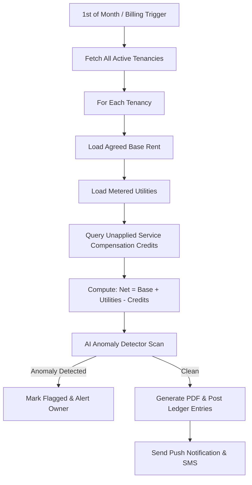
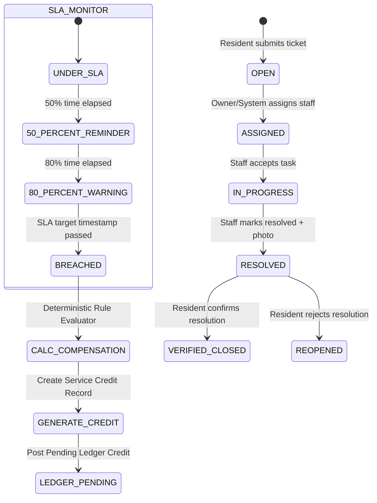
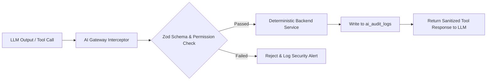
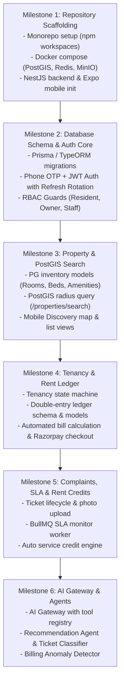

# Stayra — Technical & System Architectural Design

**Document Title:** Stayra End-to-End System Architecture & Technical Specification  
**Document Version:** 1.0.0  
**Target Codebase:** Monorepo (React Native Expo + NestJS Modular Monolith + PostgreSQL/PostGIS/Redis)  
**Status:** Architecture Blueprint for Implementation  

---

## 1. System Overview & Component Topology

Stayra is architected as a **High-Performance Modular Monolith** on the backend paired with a **Cross-Platform Mobile Application** (React Native + Expo) for residents and property owners. The system unifies real-time operations, double-entry financial ledgering, geospatial discovery, deterministic SLA credit computation, and specialized AI agents.

### 1.1 High-Level Architecture Topology

```mermaid
flowchart TB
    subgraph Client Layer [Client Application Layer]
        RN_RES["Stayra Mobile App (Resident Mode)\nReact Native / Expo Router"]
        RN_OWN["Stayra Mobile App (Owner Mode)\nReact Native / Expo Router"]
        WEB_ADM["Admin & Operations Console\n(Next.js / Vite - Phase 2)"]
    end

    subgraph Gateway [Ingress & Edge Routing]
        ALB["AWS Application Load Balancer / NGINX Reverse Proxy"]
        WAF["AWS WAF (Rate Limiting, DDoS Protection)"]
    end

    subgraph Backend [Stayra Core Modular Monolith (NestJS / Node.js)]
        subgraph Core Modules
            MOD_AUTH["Auth & Session Module\n(JWT, OTP, RBAC)"]
            MOD_PROP["Property & Inventory Module\n(Rooms, Beds, PostGIS)"]
            MOD_TEN["Tenancy Lifecycle Module\n(Agreements, Transitions)"]
            MOD_COMP["Complaint & SLA Module\n(Ticket FSM, Escalation)"]
            MOD_LEDG["Financial Ledger & Billing\n(Double-Entry, Invoices)"]
            MOD_FEED["Feedback & Reputation\n(Multi-factor Scoring)"]
            MOD_NOTIF["Notification Module\n(FCM, APNs, WhatsApp)"]
        end

        subgraph AI Layer
            AI_GATEWAY["AI Gateway & Tool Calling Engine"]
            subgraph Specialized Agents
                AGT_REC["Recommendation Agent"]
                AGT_COMP["Complaint Classifier"]
                AGT_BILL["Billing Anomaly Agent"]
                AGT_OWN["Owner Copilot"]
            end
        end
    end

    subgraph Data Layer [Persistence & Caching]
        PG[(PostgreSQL 16 + PostGIS + pgvector)]
        REDIS[(Redis 7.2 Cluster\nCache, Rate Limits, BullMQ)]
        S3[(AWS S3 / Cloudflare R2\nPhotos, KYC, Invoices)]
    end

    subgraph Workers [Async Processing (BullMQ Workers)]
        W_BILL["Billing Generation Worker"]
        W_SLA["SLA Breach & Credit Monitor"]
        W_NOTIF["Push Notification Dispatcher"]
        W_AI["AI Async Task Worker"]
    end

    subgraph External [External Services]
        EXT_PAY["Razorpay / Stripe Payment Gateway"]
        EXT_SMS["Twilio / MSG91 (OTP & SMS)"]
        EXT_LLM["LLM Providers (OpenAI / Anthropic / Gemini)"]
    end

    Client Layer -->|HTTPS / WSS| WAF --> ALB --> Backend
    Backend --> PG
    Backend --> REDIS
    Backend --> S3
    Backend --> EXT_PAY
    Backend --> EXT_SMS
    AI_GATEWAY --> EXT_LLM

    REDIS <--> Workers
    Workers --> PG
    Workers --> EXT_PAY
    Workers --> EXT_SMS
```

---

## 2. Monorepo Repository Structure

We organize Stayra as a TypeScript monorepo using **npm workspaces** or **Turborepo**. This shares types, DTOs, and validation schemas between the mobile app, backend API, and background workers with zero duplication.

```
stayra/
├── .github/
│   └── workflows/                # CI/CD pipelines (Lint, Test, Docker Build, Deploy)
├── apps/
│   ├── mobile/                   # React Native (Expo SDK 51+ / Expo Router)
│   │   ├── app/                  # File-based routing (tabs, auth, modals)
│   │   │   ├── (auth)/           # Login, OTP verification, onboarding
│   │   │   ├── (resident)/       # Resident tabs (Discover, My Stay, Bills, Tickets, Profile)
│   │   │   ├── (owner)/          # Owner tabs (Dashboard, Properties, Billing, Complaints)
│   │   │   ├── _layout.tsx       # Root layout with Role-based routing
│   │   │   └── index.tsx
│   │   ├── src/
│   │   │   ├── components/       # Atomic UI library (cards, inputs, badges, sheets)
│   │   │   ├── features/         # Feature-specific logic & screens
│   │   │   ├── hooks/            # Custom React hooks
│   │   │   ├── services/         # API clients (Axios/Ky with auth interceptors)
│   │   │   ├── stores/           # Zustand stores (AuthStore, TenancyStore)
│   │   │   └── theme/            # Design tokens (colors, typography, spacing)
│   │   ├── package.json
│   │   ├── tsconfig.json
│   │   └── app.json
│   │
│   └── backend/                  # NestJS Modular Monolith
│       ├── src/
│       │   ├── common/           # Interceptors, Filters, Guards, Decorators, Base Entities
│       │   ├── config/           # Environment validation (Zod / Joi)
│       │   ├── database/         # DataSource, TypeORM / Prisma migrations, seeds
│       │   ├── modules/
│       │   │   ├── auth/         # JWT, Refresh Tokens, Phone OTP, OAuth
│       │   │   ├── users/        # User accounts, KYC docs, Stayra Resident ID
│       │   │   ├── properties/   # PGs, Rooms, Beds, Amenities, Food Menus (PostGIS)
│       │   │   ├── tenancies/    # Room requests, contracts, move-in/out state machine
│       │   │   ├── billing/      # Bill generation, line items, metering calculations
│       │   │   ├── ledger/       # Immutable Double-Entry Ledger, balance reconciliation
│       │   │   ├── payments/     # Payment orders, webhooks, signature verification
│       │   │   ├── complaints/   # Ticket CRUD, SLA calculation, photo uploads
│       │   │   ├── compensation/ # SLA breach evaluation, deterministic rent credits
│       │   │   ├── feedback/     # Post-resolution surveys, multidimensional reputation
│       │   │   ├── notifications/# Push (Expo/FCM), SMS (Twilio/MSG91), WhatsApp
│       │   │   └── ai/           # AI Gateway, Tool registry, Agent orchestrators
│       │   ├── workers/          # BullMQ worker processors (Billing, SLA monitor)
│       │   ├── app.module.ts
│       │   └── main.ts
│       ├── test/
│       ├── package.json
│       └── tsconfig.json
│
├── packages/
│   ├── shared-types/             # Cross-platform TypeScript interfaces, Enums, DTOs
│   │   ├── src/
│   │   │   ├── auth.types.ts
│   │   │   ├── property.types.ts
│   │   │   ├── tenancy.types.ts
│   │   │   ├── billing.types.ts
│   │   │   ├── complaint.types.ts
│   │   │   ├── ai.types.ts
│   │   │   └── index.ts
│   │   └── package.json
│   ├── validation-schemas/       # Zod schemas used by both frontend forms & backend DTOs
│   │   ├── src/
│   │   │   ├── auth.schema.ts
│   │   │   ├── complaint.schema.ts
│   │   │   ├── property.schema.ts
│   │   │   └── index.ts
│   │   └── package.json
│   └── database-schema/          # Prisma / Kysely / Migration scripts
│       ├── prisma/
│       │   └── schema.prisma
│       └── package.json
│
├── docker/
│   ├── docker-compose.dev.yml    # PostgreSQL with PostGIS, Redis, MinIO S3
│   ├── Dockerfile.backend
│   └── Dockerfile.mobile
├── package.json
├── turbo.json
└── README.md
```

---

## 3. Database Schema & Data Modeling

Stayra uses **PostgreSQL 16** with:
- **`postgis`**: Geodetic distance, bounding boxes, spatial clustering.
- **`uuid-ossp`** or `gen_random_uuid()`: Globally unique non-sequential keys.
- **`pgvector`**: Property embeddings for natural language search & semantic matching.

### 3.1 Entity Relationship Diagram



### 3.2 Detailed SQL Table Definitions

#### 1. Core Users, Identity & RBAC
```sql
CREATE TYPE user_role_enum AS ENUM ('RESIDENT', 'OWNER', 'STAFF', 'ADMIN');
CREATE TYPE kyc_status_enum AS ENUM ('UNVERIFIED', 'PENDING', 'VERIFIED', 'REJECTED');

CREATE TABLE users (
    id UUID PRIMARY KEY DEFAULT gen_random_uuid(),
    phone_number VARCHAR(20) UNIQUE NOT NULL,
    email VARCHAR(255) UNIQUE,
    full_name VARCHAR(150) NOT NULL,
    avatar_url TEXT,
    role user_role_enum NOT NULL DEFAULT 'RESIDENT',
    is_active BOOLEAN NOT NULL DEFAULT TRUE,
    created_at TIMESTAMPTZ NOT NULL DEFAULT NOW(),
    updated_at TIMESTAMPTZ NOT NULL DEFAULT NOW()
);

-- Persistent Stayra Resident ID (Independent of any single PG)
CREATE TABLE resident_profiles (
    id UUID PRIMARY KEY DEFAULT gen_random_uuid(),
    user_id UUID NOT NULL UNIQUE REFERENCES users(id) ON DELETE CASCADE,
    stayra_resident_id VARCHAR(32) UNIQUE NOT NULL, -- e.g. STR-RES-202609-0842
    emergency_contact_name VARCHAR(150),
    emergency_contact_phone VARCHAR(20),
    kyc_status kyc_status_enum NOT NULL DEFAULT 'UNVERIFIED',
    kyc_document_type VARCHAR(50), -- AADHAAR, PASSPORT, PAN
    kyc_document_s3_key TEXT,
    lifetime_reputation_score NUMERIC(3,2) DEFAULT 5.00,
    created_at TIMESTAMPTZ NOT NULL DEFAULT NOW(),
    updated_at TIMESTAMPTZ NOT NULL DEFAULT NOW()
);

CREATE TABLE owner_profiles (
    id UUID PRIMARY KEY DEFAULT gen_random_uuid(),
    user_id UUID NOT NULL UNIQUE REFERENCES users(id) ON DELETE CASCADE,
    business_name VARCHAR(255),
    gstin VARCHAR(50),
    bank_account_number VARCHAR(50),
    bank_ifsc_code VARCHAR(20),
    bank_beneficiary_name VARCHAR(150),
    payout_account_verified BOOLEAN NOT NULL DEFAULT FALSE,
    created_at TIMESTAMPTZ NOT NULL DEFAULT NOW(),
    updated_at TIMESTAMPTZ NOT NULL DEFAULT NOW()
);

CREATE TABLE staff_profiles (
    id UUID PRIMARY KEY DEFAULT gen_random_uuid(),
    user_id UUID NOT NULL REFERENCES users(id) ON DELETE CASCADE,
    assigned_property_id UUID NOT NULL, -- references properties(id)
    job_title VARCHAR(100) NOT NULL, -- Electrician, Plumber, Housekeeping, Manager
    can_resolve_tickets BOOLEAN NOT NULL DEFAULT TRUE,
    created_at TIMESTAMPTZ NOT NULL DEFAULT NOW()
);
```

#### 2. Property, Room & Bed Inventory (With PostGIS)
```sql
CREATE EXTENSION IF NOT EXISTS postgis;
CREATE EXTENSION IF NOT EXISTS vector;

CREATE TYPE room_sharing_enum AS ENUM ('SINGLE', 'DOUBLE', 'TRIPLE', 'FOUR_SHARING', 'DORMITORY');
CREATE TYPE bed_status_enum AS ENUM ('VACANT', 'RESERVED', 'OCCUPIED', 'MAINTENANCE');

CREATE TABLE properties (
    id UUID PRIMARY KEY DEFAULT gen_random_uuid(),
    owner_id UUID NOT NULL REFERENCES owner_profiles(id) ON DELETE RESTRICT,
    name VARCHAR(255) NOT NULL,
    description TEXT,
    address_line1 TEXT NOT NULL,
    address_line2 TEXT,
    city VARCHAR(100) NOT NULL,
    state VARCHAR(100) NOT NULL,
    postal_code VARCHAR(20) NOT NULL,
    coordinates GEOGRAPHY(Point, 4326) NOT NULL, -- PostGIS Point (Longitude, Latitude)
    gender_category VARCHAR(20) NOT NULL, -- MALE, FEMALE, UNISEX
    notice_period_days INT NOT NULL DEFAULT 30,
    curfew_time TIME,
    is_verified BOOLEAN NOT NULL DEFAULT FALSE,
    embedding VECTOR(1536), -- Vector representation for semantic natural language search
    created_at TIMESTAMPTZ NOT NULL DEFAULT NOW(),
    updated_at TIMESTAMPTZ NOT NULL DEFAULT NOW()
);

CREATE INDEX idx_properties_coordinates ON properties USING GIST (coordinates);
CREATE INDEX idx_properties_city ON properties (city);

CREATE TABLE rooms (
    id UUID PRIMARY KEY DEFAULT gen_random_uuid(),
    property_id UUID NOT NULL REFERENCES properties(id) ON DELETE CASCADE,
    room_number VARCHAR(50) NOT NULL,
    floor_number INT NOT NULL,
    sharing_type room_sharing_enum NOT NULL,
    has_attached_bathroom BOOLEAN NOT NULL DEFAULT TRUE,
    has_ac BOOLEAN NOT NULL DEFAULT FALSE,
    has_balcony BOOLEAN NOT NULL DEFAULT FALSE,
    base_rent_per_bed NUMERIC(10,2) NOT NULL,
    security_deposit NUMERIC(10,2) NOT NULL,
    is_active BOOLEAN NOT NULL DEFAULT TRUE,
    created_at TIMESTAMPTZ NOT NULL DEFAULT NOW(),
    UNIQUE(property_id, room_number)
);

CREATE TABLE beds (
    id UUID PRIMARY KEY DEFAULT gen_random_uuid(),
    room_id UUID NOT NULL REFERENCES rooms(id) ON DELETE CASCADE,
    bed_identifier VARCHAR(20) NOT NULL, -- e.g. Bed-A, Bed-B
    status bed_status_enum NOT NULL DEFAULT 'VACANT',
    current_tenancy_id UUID, -- References active tenancy
    created_at TIMESTAMPTZ NOT NULL DEFAULT NOW(),
    UNIQUE(room_id, bed_identifier)
);

CREATE TABLE property_amenities (
    id UUID PRIMARY KEY DEFAULT gen_random_uuid(),
    property_id UUID NOT NULL REFERENCES properties(id) ON DELETE CASCADE,
    amenity_code VARCHAR(50) NOT NULL, -- WIFI, POWER_BACKUP, WASHING_MACHINE, GYM, CCTV, RO_WATER
    is_free BOOLEAN NOT NULL DEFAULT TRUE,
    monthly_charge NUMERIC(10,2) DEFAULT 0.00,
    created_at TIMESTAMPTZ NOT NULL DEFAULT NOW(),
    UNIQUE(property_id, amenity_code)
);
```

#### 3. Tenancy Lifecycle Management
```sql
CREATE TYPE tenancy_status_enum AS ENUM (
    'REQUESTED', 
    'OWNER_APPROVED', 
    'CONFIRMED', 
    'ACTIVE', 
    'NOTICE_PERIOD', 
    'SETTLEMENT_PENDING', 
    'COMPLETED', 
    'CANCELLED'
);

CREATE TABLE tenancies (
    id UUID PRIMARY KEY DEFAULT gen_random_uuid(),
    resident_id UUID NOT NULL REFERENCES resident_profiles(id) ON DELETE RESTRICT,
    property_id UUID NOT NULL REFERENCES properties(id) ON DELETE RESTRICT,
    bed_id UUID NOT NULL REFERENCES beds(id) ON DELETE RESTRICT,
    status tenancy_status_enum NOT NULL DEFAULT 'REQUESTED',
    start_date DATE NOT NULL,
    end_date DATE,
    actual_move_out_date DATE,
    agreed_rent NUMERIC(10,2) NOT NULL,
    agreed_deposit NUMERIC(10,2) NOT NULL,
    billing_day_of_month INT NOT NULL DEFAULT 1, -- Billing date (1st of month)
    digital_agreement_s3_key TEXT,
    agreement_signed_at TIMESTAMPTZ,
    cancellation_reason TEXT,
    created_at TIMESTAMPTZ NOT NULL DEFAULT NOW(),
    updated_at TIMESTAMPTZ NOT NULL DEFAULT NOW()
);

CREATE INDEX idx_tenancies_resident ON tenancies (resident_id);
CREATE INDEX idx_tenancies_property_status ON tenancies (property_id, status);
```

#### 4. Double-Entry Financial Ledger & Rent Automation
```sql
CREATE TYPE account_type_enum AS ENUM (
    'ASSET_ESCROW', 
    'LIABILITY_DEPOSIT', 
    'RECEIVABLE_RESIDENT', 
    'REVENUE_RENT', 
    'REVENUE_UTILITIES', 
    'EXPENSE_SERVICE_COMPENSATION'
);

CREATE TABLE ledger_accounts (
    id UUID PRIMARY KEY DEFAULT gen_random_uuid(),
    account_type account_type_enum NOT NULL,
    property_id UUID REFERENCES properties(id) ON DELETE CASCADE,
    resident_id UUID REFERENCES resident_profiles(id) ON DELETE CASCADE,
    name VARCHAR(150) NOT NULL,
    currency VARCHAR(3) NOT NULL DEFAULT 'INR',
    created_at TIMESTAMPTZ NOT NULL DEFAULT NOW(),
    UNIQUE(account_type, property_id, resident_id)
);

CREATE TABLE ledger_entries (
    id UUID PRIMARY KEY DEFAULT gen_random_uuid(),
    transaction_group_id UUID NOT NULL, -- Links debit and credit pairs
    debit_account_id UUID NOT NULL REFERENCES ledger_accounts(id),
    credit_account_id UUID NOT NULL REFERENCES ledger_accounts(id),
    amount NUMERIC(12,2) NOT NULL CHECK (amount > 0),
    description TEXT NOT NULL,
    idempotency_key VARCHAR(128) UNIQUE NOT NULL,
    reference_entity_type VARCHAR(50) NOT NULL, -- BILL, PAYMENT, COMPENSATION, DEPOSIT_REFUND
    reference_entity_id UUID NOT NULL,
    posted_at TIMESTAMPTZ NOT NULL DEFAULT NOW()
);

CREATE INDEX idx_ledger_entries_reference ON ledger_entries(reference_entity_type, reference_entity_id);

CREATE TYPE bill_status_enum AS ENUM ('DRAFT', 'ISSUED', 'PARTIALLY_PAID', 'PAID', 'OVERDUE', 'VOID');

CREATE TABLE bills (
    id UUID PRIMARY KEY DEFAULT gen_random_uuid(),
    tenancy_id UUID NOT NULL REFERENCES tenancies(id) ON DELETE RESTRICT,
    billing_period_start DATE NOT NULL,
    billing_period_end DATE NOT NULL,
    due_date DATE NOT NULL,
    subtotal_amount NUMERIC(10,2) NOT NULL DEFAULT 0.00,
    total_service_credits NUMERIC(10,2) NOT NULL DEFAULT 0.00,
    final_payable_amount NUMERIC(10,2) NOT NULL DEFAULT 0.00,
    paid_amount NUMERIC(10,2) NOT NULL DEFAULT 0.00,
    status bill_status_enum NOT NULL DEFAULT 'DRAFT',
    invoice_number VARCHAR(64) UNIQUE NOT NULL,
    pdf_s3_key TEXT,
    ai_anomaly_flagged BOOLEAN NOT NULL DEFAULT FALSE,
    ai_anomaly_reason TEXT,
    created_at TIMESTAMPTZ NOT NULL DEFAULT NOW(),
    updated_at TIMESTAMPTZ NOT NULL DEFAULT NOW()
);

CREATE TYPE bill_item_category_enum AS ENUM (
    'BASE_RENT', 
    'ELECTRICITY_METERED', 
    'WATER_CHARGES', 
    'FOOD_MESS', 
    'MAINTENANCE', 
    'SERVICE_COMPENSATION_CREDIT', 
    'ONE_TIME_CHARGE'
);

CREATE TABLE bill_items (
    id UUID PRIMARY KEY DEFAULT gen_random_uuid(),
    bill_id UUID NOT NULL REFERENCES bills(id) ON DELETE CASCADE,
    category bill_item_category_enum NOT NULL,
    description VARCHAR(255) NOT NULL,
    quantity NUMERIC(8,2) NOT NULL DEFAULT 1.00,
    unit_price NUMERIC(10,2) NOT NULL,
    total_amount NUMERIC(10,2) NOT NULL, -- negative if credit
    metadata JSONB, -- stores meter reading photos, previous/current units
    created_at TIMESTAMPTZ NOT NULL DEFAULT NOW()
);
```

#### 5. Complaint Management, SLAs & Rent Compensation
```sql
CREATE TYPE complaint_category_enum AS ENUM (
    'WATER', 
    'ELECTRICITY', 
    'WIFI', 
    'AC', 
    'FOOD', 
    'HOUSEKEEPING', 
    'PLUMBING', 
    'SECURITY', 
    'OTHER'
);

CREATE TYPE complaint_severity_enum AS ENUM ('LOW', 'MEDIUM', 'HIGH', 'CRITICAL');
CREATE TYPE complaint_status_enum AS ENUM (
    'OPEN', 
    'ASSIGNED', 
    'IN_PROGRESS', 
    'RESOLVED', 
    'VERIFIED_CLOSED', 
    'REOPENED', 
    'CANCELLED'
);

CREATE TABLE sla_policies (
    id UUID PRIMARY KEY DEFAULT gen_random_uuid(),
    property_id UUID NOT NULL REFERENCES properties(id) ON DELETE CASCADE,
    category complaint_category_enum NOT NULL,
    severity complaint_severity_enum NOT NULL,
    resolution_sla_hours INT NOT NULL, -- e.g. 4 hours, 24 hours
    compensation_rate_per_day NUMERIC(10,2) NOT NULL DEFAULT 0.00, -- e.g. 100.00 per day
    max_compensation_cap NUMERIC(10,2) NOT NULL DEFAULT 2000.00,
    created_at TIMESTAMPTZ NOT NULL DEFAULT NOW(),
    UNIQUE(property_id, category, severity)
);

CREATE TABLE complaints (
    id UUID PRIMARY KEY DEFAULT gen_random_uuid(),
    tenancy_id UUID NOT NULL REFERENCES tenancies(id) ON DELETE RESTRICT,
    property_id UUID NOT NULL REFERENCES properties(id) ON DELETE RESTRICT,
    resident_id UUID NOT NULL REFERENCES resident_profiles(id) ON DELETE RESTRICT,
    assigned_staff_id UUID REFERENCES staff_profiles(id),
    ticket_number VARCHAR(32) UNIQUE NOT NULL, -- e.g. TKT-2026-00392
    category complaint_category_enum NOT NULL,
    severity complaint_severity_enum NOT NULL DEFAULT 'MEDIUM',
    status complaint_status_enum NOT NULL DEFAULT 'OPEN',
    title VARCHAR(255) NOT NULL,
    description TEXT NOT NULL,
    sla_target_time TIMESTAMPTZ NOT NULL,
    actual_resolved_at TIMESTAMPTZ,
    is_sla_breached BOOLEAN NOT NULL DEFAULT FALSE,
    resolution_notes TEXT,
    created_at TIMESTAMPTZ NOT NULL DEFAULT NOW(),
    updated_at TIMESTAMPTZ NOT NULL DEFAULT NOW()
);

CREATE INDEX idx_complaints_property_status ON complaints(property_id, status);
CREATE INDEX idx_complaints_sla ON complaints(status, sla_target_time) WHERE status NOT IN ('RESOLVED', 'VERIFIED_CLOSED', 'CANCELLED');

CREATE TABLE complaint_attachments (
    id UUID PRIMARY KEY DEFAULT gen_random_uuid(),
    complaint_id UUID NOT NULL REFERENCES complaints(id) ON DELETE CASCADE,
    uploaded_by_user_id UUID NOT NULL REFERENCES users(id),
    file_type VARCHAR(20) NOT NULL, -- IMAGE, VIDEO, AUDIO
    s3_key TEXT NOT NULL,
    file_size_bytes BIGINT,
    created_at TIMESTAMPTZ NOT NULL DEFAULT NOW()
);

-- Service-Level-Based Rent Compensation
CREATE TABLE service_compensation_credits (
    id UUID PRIMARY KEY DEFAULT gen_random_uuid(),
    complaint_id UUID NOT NULL UNIQUE REFERENCES complaints(id) ON DELETE RESTRICT,
    resident_id UUID NOT NULL REFERENCES resident_profiles(id) ON DELETE RESTRICT,
    property_id UUID NOT NULL REFERENCES properties(id) ON DELETE RESTRICT,
    applied_to_bill_id UUID REFERENCES bills(id),
    credit_amount NUMERIC(10,2) NOT NULL CHECK (credit_amount > 0),
    breach_duration_hours NUMERIC(6,2) NOT NULL,
    calculation_basis TEXT NOT NULL, -- e.g. "WiFi down for 52h (28h breach) at ₹100/day"
    status VARCHAR(20) NOT NULL DEFAULT 'PENDING', -- PENDING, APPLIED_TO_BILL, REFUNDED
    created_at TIMESTAMPTZ NOT NULL DEFAULT NOW()
);
```

#### 6. Verified Feedback & Reputation Engine
```sql
CREATE TABLE feedback_reviews (
    id UUID PRIMARY KEY DEFAULT gen_random_uuid(),
    tenancy_id UUID NOT NULL REFERENCES tenancies(id) ON DELETE CASCADE,
    complaint_id UUID REFERENCES complaints(id) ON DELETE SET NULL,
    resident_id UUID NOT NULL REFERENCES resident_profiles(id) ON DELETE CASCADE,
    property_id UUID NOT NULL REFERENCES properties(id) ON DELETE CASCADE,
    speed_rating INT CHECK (speed_rating BETWEEN 1 AND 5),
    cleanliness_rating INT CHECK (cleanliness_rating BETWEEN 1 AND 5),
    food_rating INT CHECK (food_rating BETWEEN 1 AND 5),
    wifi_rating INT CHECK (wifi_rating BETWEEN 1 AND 5),
    staff_rating INT CHECK (staff_rating BETWEEN 1 AND 5),
    overall_rating NUMERIC(2,1) NOT NULL CHECK (overall_rating BETWEEN 1.0 AND 5.0),
    review_text TEXT,
    created_at TIMESTAMPTZ NOT NULL DEFAULT NOW()
);

CREATE TABLE reputation_scores (
    property_id UUID PRIMARY KEY REFERENCES properties(id) ON DELETE CASCADE,
    overall_score NUMERIC(3,2) NOT NULL DEFAULT 5.00,
    cleanliness_score NUMERIC(3,2) NOT NULL DEFAULT 5.00,
    food_score NUMERIC(3,2) NOT NULL DEFAULT 5.00,
    maintenance_score NUMERIC(3,2) NOT NULL DEFAULT 5.00,
    wifi_score NUMERIC(3,2) NOT NULL DEFAULT 5.00,
    safety_score NUMERIC(3,2) NOT NULL DEFAULT 5.00,
    total_reviews_count INT NOT NULL DEFAULT 0,
    sla_compliance_rate NUMERIC(5,2) NOT NULL DEFAULT 100.00, -- e.g. 94.25%
    avg_resolution_time_hours NUMERIC(6,2) NOT NULL DEFAULT 0.00,
    last_recalculated_at TIMESTAMPTZ NOT NULL DEFAULT NOW()
);
```

#### 7. AI Gateway, Tool Calling & Audit Logs
```sql
CREATE TABLE ai_conversations (
    id UUID PRIMARY KEY DEFAULT gen_random_uuid(),
    user_id UUID NOT NULL REFERENCES users(id) ON DELETE CASCADE,
    agent_type VARCHAR(50) NOT NULL, -- RECOMMENDATION, COMPLAINT, BILLING, OWNER_COPILOT
    context_metadata JSONB,
    created_at TIMESTAMPTZ NOT NULL DEFAULT NOW()
);

CREATE TABLE ai_messages (
    id UUID PRIMARY KEY DEFAULT gen_random_uuid(),
    conversation_id UUID NOT NULL REFERENCES ai_conversations(id) ON DELETE CASCADE,
    role VARCHAR(20) NOT NULL, -- SYSTEM, USER, ASSISTANT, TOOL
    content TEXT,
    tool_calls JSONB,
    created_at TIMESTAMPTZ NOT NULL DEFAULT NOW()
);

-- Immutable AI Audit Log (Every AI action is tracked for safety)
CREATE TABLE ai_audit_logs (
    id UUID PRIMARY KEY DEFAULT gen_random_uuid(),
    user_id UUID NOT NULL REFERENCES users(id),
    agent_type VARCHAR(50) NOT NULL,
    action_type VARCHAR(100) NOT NULL, -- EXTRACT_INTENT, CLASSIFY_TICKET, FLAG_BILL_ANOMALY
    prompt_tokens INT NOT NULL,
    completion_tokens INT NOT NULL,
    cost_usd NUMERIC(8,6) NOT NULL DEFAULT 0.000000,
    model_version VARCHAR(50) NOT NULL,
    tool_name VARCHAR(100),
    tool_arguments JSONB,
    tool_result JSONB,
    latency_ms INT NOT NULL,
    created_at TIMESTAMPTZ NOT NULL DEFAULT NOW()
);
```

---

## 4. Backend Modular Monolith Architecture (NestJS)

We follow Domain-Driven Design (DDD) principles with bounded contexts mapped directly to NestJS modules.



### 4.1 Module Boundary Definitions

1. **`AuthModule`**:
   - Handles OTP generation via Redis, JWT signing, refresh token rotation, device session invalidation.
   - Decorators: `@CurrentUser()`, `@Roles('RESIDENT', 'OWNER')`, `@Public()`.
2. **`PropertyModule`**:
   - PostGIS spatial querying via ST_DWithin and ST_DistanceSphere.
   - Vector search integration with `pgvector` for semantic recommendations.
3. **`TenancyModule`**:
   - State machine governing tenancy transitions (`REQUESTED` $\to$ `APPROVED` $\to$ `ACTIVE` $\to$ `COMPLETED`).
   - Ensures bed availability locking to prevent double-booking.
4. **`LedgerModule` & `BillingModule`**:
   - Double-entry accounting ledger guarantees financial immutability.
   - Automated cron generation of monthly bills with utility meter parsing.
5. **`ComplaintModule` & `CompensationModule`**:
   - Manages ticket lifecycles, SLA timer countdowns, and triggers `SLA_BREACHED` events.
   - Pure deterministic compensation calculations based on owner-configured rates.
6. **`AiModule` (The AI Gateway)**:
   - Tool calling router with JSON schema validation.
   - Enforces the **Zero-Direct-Database-Mutation** rule for all LLM outputs.

---

## 5. Mobile Application Architecture (React Native + Expo)

### 5.1 Architecture Stack & Dependencies
- **Runtime:** React Native 0.74+ with React 18 / Expo SDK 51+ (New Architecture enabled).
- **Navigation:** Expo Router v3 (file-based routing, native tab bars, stack modals).
- **Global State:** Zustand (lightweight client state for active session, current role, filter sheet state).
- **Server State & Caching:** TanStack Query v5 (`@tanstack/react-query`) with automatic background refetching, optimistic updates for ticket comments, and offline cache hydration.
- **Form Management:** React Hook Form + Zod resolvers for instant client-side validation.
- **Styling:** Custom Design System using StyleSheet tokens or NativeWind (Tailwind CSS for React Native) supporting dynamic Dark/Light modes.
- **Offline & Storage:** `@react-native-async-storage/async-storage` + `expo-secure-store` for cryptographic token storage.

### 5.2 Navigation Layout Hierarchy

```text
app/
├── _layout.tsx                     # Root providers: QueryClient, AuthProvider, ThemeProvider
├── index.tsx                       # Splash / Initial route redirection based on session
├── (auth)/                         # Authentication flow
│   ├── login.tsx                   # Phone number input
│   ├── otp.tsx                     # 6-digit OTP verification
│   └── select-role.tsx             # Resident or Owner onboarding
│
├── (resident)/                     # Resident Tab Navigator
│   ├── _layout.tsx                 # Tab navigation layout (Home, My Stay, Tickets, Profile)
│   ├── index.tsx                   # Discover PGs (Interactive Map + Search Card list)
│   ├── pg/[id].tsx                 # Detailed PG Profile, room carousel, reviews
│   ├── my-stay/
│   │   ├── index.tsx               # Current room, roommates, daily food menu
│   │   └── rent-breakdown.tsx      # Current invoice breakdown & Razorpay checkout
│   ├── complaints/
│   │   ├── index.tsx               # Active & Past complaints with SLA countdown badges
│   │   ├── new.tsx                 # Raise ticket with photo capture & AI description
│   │   └── [id].tsx                # Live ticket timeline, chat with staff, resolution proof
│   └── profile/
│       ├── index.tsx               # Stayra Resident ID card, KYC badge
│       └── move-out.tsx            # Digital 30-day notice trigger & deposit refund calculator
│
├── (owner)/                        # Owner Tab Navigator
│   ├── _layout.tsx                 # Tab navigation layout (Overview, Rooms, Bills, Tickets)
│   ├── index.tsx                   # Executive dashboard (Occupancy %, Revenue, Open SLAs)
│   ├── properties/
│   │   ├── index.tsx               # Property list
│   │   ├── new.tsx                 # Add PG multi-step form
│   │   └── [id]/rooms.tsx          # Bed grid & tenant allocation
│   ├── billing/
│   │   ├── index.tsx               # Monthly bill generator & unpaid tracking
│   │   └── record-meter.tsx        # Sub-meter camera upload
│   └── complaints/
│       ├── index.tsx               # Priority kanban: Breaching Soon vs Normal
│       └── [id].tsx                # Assign staff & log resolution
│
└── (modals)/                       # Shared modals
    ├── ai-assistant.tsx            # Floating AI Copilot drawer
    └── image-viewer.tsx
```

---

## 6. Financial Ledger & Rent Automation Engine

### 6.1 Double-Entry Principles
Stayra enforces standard accounting equations:
$$\text{Assets} = \text{Liabilities} + \text{Equity} \quad \text{and} \quad \sum \text{Debits} = \sum \text{Credits}$$

Every financial action generates matching debit and credit entries inside a single atomic database transaction (`SELECT FOR UPDATE` or Prisma `$transaction`).

#### Transaction Examples:
1. **Monthly Invoice Generation:**
   - **Debit:** `RECEIVABLE_RESIDENT` (Tenant owes total payable)
   - **Credit:** `REVENUE_RENT` (Owner base rent income)
   - **Credit:** `REVENUE_UTILITIES` (Owner electricity/water recovery)
2. **SLA Breach Compensation Credit Applied:**
   - **Debit:** `EXPENSE_SERVICE_COMPENSATION` (Owner maintenance penalty expense)
   - **Credit:** `RECEIVABLE_RESIDENT` (Reduces tenant's net payable)
3. **Resident Pays via Gateway:**
   - **Debit:** `ASSET_ESCROW` (Payment processor holds funds)
   - **Credit:** `RECEIVABLE_RESIDENT` (Tenant's outstanding balance cleared to zero)

### 6.2 Billing Calculation Algorithm
$$\text{Final Payable} = \text{Base Rent} + \text{Fixed Amenities} + \sum (\Delta \text{Meter Units} \times \text{Unit Rate}) - \sum \text{Unapplied SLA Credits}$$



---

## 7. SLA Engine & Deterministic Compensation Workflow

The system uses an asynchronous heartbeat worker (`BullMQ`) checking unresolved tickets every 15 minutes.



### Deterministic Compensation Calculation Function
```typescript
interface SlaPolicy {
  resolutionSlaHours: number;
  compensationRatePerDay: number; // e.g. 100 INR
  maxCompensationCap: number;     // e.g. 2000 INR
}

export function calculateSlaCompensation(
  createdAt: Date,
  resolvedAt: Date | null,
  now: Date,
  policy: SlaPolicy
): { isBreached: boolean; breachHours: number; compensationCredit: number } {
  const targetEndTime = resolvedAt ?? now;
  const totalDurationHours = (targetEndTime.getTime() - createdAt.getTime()) / (1000 * 60 * 60);

  if (totalDurationHours <= policy.resolutionSlaHours) {
    return { isBreached: false, breachHours: 0, compensationCredit: 0 };
  }

  const breachHours = totalDurationHours - policy.resolutionSlaHours;
  const breachDays = Math.ceil(breachHours / 24);
  const rawCompensation = breachDays * policy.compensationRatePerDay;
  const finalCompensation = Math.min(rawCompensation, policy.maxCompensationCap);

  return {
    isBreached: true,
    breachHours: Math.round(breachHours * 10) / 10,
    compensationCredit: finalCompensation,
  };
}
```

---

## 8. AI Agent Architecture & Safety Guardrails

### 8.1 Multi-Agent Specialization
Instead of a single monolithic prompt, Stayra deploys four targeted agents:

| Agent Name | Trigger Context | Primary LLM Capability | Controlled Tool Access |
|---|---|---|---|
| **Recommendation Agent** | Resident Natural Language Discovery | Converts unstructured preferences into SQL/PostGIS filters & ranks matches | `search_pgs_by_geo()`, `filter_by_amenities()`, `get_pg_reputation_summary()` |
| **Complaint Classifier** | Resident ticket creation (Text/Audio/Photo) | Categorizes issue, detects urgency/fire hazard, maps to SLA tier | `fetch_sla_policy()`, `suggest_staff_assignment()`, `create_ticket_draft()` |
| **Billing Anomaly Agent** | Post-bill generation batch | Compares utility charges against 3-month rolling average; flags spikes | `get_resident_historical_bills()`, `flag_bill_anomaly()`, `request_meter_recheck()` |
| **Owner Copilot** | Owner queries dashboard | Aggregates occupancy, revenue trends, top recurring hardware failures | `get_occupancy_metrics()`, `get_overdue_rent_list()`, `get_recurring_tickets()` |

### 8.2 Security Guardrails & Tool Execution Boundaries



**Non-Negotiable AI Rules:**
1. **Read-Only or Draft-Only:** AI agents can only *read* database state or create *draft* records (e.g., ticket draft, anomaly alert).
2. **Zero Financial Mutation:** An LLM is never permitted to write directly to `ledger_entries` or modify `bills.final_payable_amount`. All ledger posts are executed strictly by deterministic backend business services after human confirmation or hard-coded rules.
3. **Prompt Injection Prevention:** User inputs (complaint text, search query) are wrapped in rigid schema boundaries and parameterized before being sent to LLM tools.

---

## 9. Background Jobs & Asynchronous Workflows (BullMQ + Redis)

| Queue Name | Job Name | Frequency / Trigger | Action |
|---|---|---|---|
| `sla-monitor-queue` | `check-ticket-slas` | Recurring every 15 minutes | Scans open tickets, checks against target timestamps, marks breached, creates compensation credits |
| `billing-queue` | `generate-monthly-bills` | Cron: 1st of month at 00:01 AM | Iterates active tenancies, calculates utility units, subtracts unapplied credits, emits PDF generation |
| `billing-queue` | `send-payment-reminders` | Cron: 3rd & 5th of month | Dispatches push alerts and SMS to residents with overdue bills |
| `notification-queue`| `dispatch-push` | Event-driven (e.g., ticket update) | Sends FCM/APNs payload to device tokens |
| `ai-tasks-queue` | `reindex-pg-embeddings` | Triggered on PG profile update | Generates text embeddings and updates `properties.embedding` column |

---

## 10. Security, Multi-Tenancy & Authorization

### 10.1 Authentication & Token Lifecycle
- **Access Token:** Short-lived JWT (15 minutes expiry), signed with RS256 private key or HS256 with 512-bit secret. Contains `sub` (User ID), `role`, and `resident_id` / `owner_id`.
- **Refresh Token:** Cryptographically random 256-bit token stored hashed (SHA-256) in PostgreSQL/Redis with a 30-day sliding expiry. Token rotation is enforced on every refresh call to prevent replay attacks.
- **Biometric & SecureStore:** The mobile client stores the refresh token exclusively in iOS Keychain / Android Keystore.

### 10.2 NestJS Guards & Multi-Tenant Isolation
```typescript
@Injectable()
export class PropertyOwnershipGuard implements CanActivate {
  constructor(private readonly propertyService: PropertyService) {}

  async canActivate(context: ExecutionContext): Promise<boolean> {
    const request = context.switchToHttp().getRequest();
    const user = request.user;
    const propertyId = request.params.propertyId || request.body.propertyId;

    if (user.role === 'ADMIN') return true;
    if (user.role !== 'OWNER') return false;

    const property = await this.propertyService.findById(propertyId);
    return property?.ownerId === user.ownerProfileId;
  }
}
```

---

## 11. Core REST API Specifications

### 11.1 Authentication & Profile
- `POST /api/v1/auth/otp/send`: Initiates mobile phone OTP.
- `POST /api/v1/auth/otp/verify`: Validates OTP; returns `{ accessToken, refreshToken, user, profile }`.
- `POST /api/v1/auth/refresh`: Exchanges refresh token for new access/refresh pair.
- `GET /api/v1/users/me`: Returns active session profile, KYC status, and Stayra Resident ID.

### 11.2 Property & Discovery (PostGIS)
- `GET /api/v1/properties/search`:
  - Query Params: `lat`, `lng`, `radiusKm=5`, `maxBudget`, `sharingType`, `amenities`, `gender`.
  - Returns array of properties with calculated `distance_meters` and reputation scores.
- `GET /api/v1/properties/:id`: Full details, available rooms/beds, food menu, rules, SLA policy.
- `POST /api/v1/properties`: (Owner only) Creates new property listing.

### 11.3 Tenancies & Agreements
- `POST /api/v1/tenancies/request`: Resident requests a room/bed.
- `PATCH /api/v1/tenancies/:id/approve`: Owner approves request; triggers digital contract generation.
- `POST /api/v1/tenancies/:id/move-out-notice`: Initiates 30-day notice period.
- `GET /api/v1/tenancies/:id/settlement`: Fetches final move-out statement with deposit refund breakdown.

### 11.4 Billing & Payments
- `GET /api/v1/bills/my-bills`: Resident fetches history of invoices and pending dues.
- `POST /api/v1/payments/create-order`: Initiates Razorpay/Stripe order with ledger pre-check.
- `POST /api/v1/payments/webhook`: Webhook endpoint with HMAC-SHA256 signature verification.

### 11.5 Complaints & SLAs
- `POST /api/v1/complaints`: Raises new ticket with category, severity, photo attachments.
- `GET /api/v1/complaints`: Fetches filtered tickets (with active SLA countdown timers).
- `PATCH /api/v1/complaints/:id/resolve`: Staff logs resolution notes and proof photo.
- `POST /api/v1/complaints/:id/feedback`: Resident submits post-resolution survey.

### 11.6 AI Gateway Endpoints
- `POST /api/v1/ai/recommend`: Natural language query $\to$ structured parameters $\to$ ranked PGs.
- `POST /api/v1/ai/classify-complaint`: Unstructured complaint text $\to$ category, severity, SLA tier.
- `POST /api/v1/ai/owner-copilot`: Owner queries property metrics conversationally.

---

## 12. Local Development & Docker Compose Setup

To get all required services running locally with one command:

```yaml
# docker/docker-compose.dev.yml
version: '3.8'

services:
  postgres:
    image: postgis/postgis:16-3.4
    container_name: stayra-postgres
    restart: always
    environment:
      POSTGRES_USER: stayra_admin
      POSTGRES_PASSWORD: stayra_secret_password
      POSTGRES_DB: stayra_dev
    ports:
      - "5432:5432"
    volumes:
      - postgres_data:/var/lib/postgresql/data

  redis:
    image: redis:7.2-alpine
    container_name: stayra-redis
    restart: always
    ports:
      - "6379:6379"
    volumes:
      - redis_data:/data

  minio:
    image: minio/minio:RELEASE.2024-05-10T01-41-38Z
    container_name: stayra-minio
    restart: always
    environment:
      MINIO_ROOT_USER: minio_admin
      MINIO_ROOT_PASSWORD: minio_password
    command: server /data --console-address ":9001"
    ports:
      - "9000:9000"
      - "9001:9001"
    volumes:
      - minio_data:/data

volumes:
  postgres_data:
  redis_data:
  minio_data:
```

---

## 13. Step-by-Step Implementation Strategy

Now that the system design and PRD are established, implementation proceeds in sequential milestones:



Both documents—[PRD.md](file:///Users/shipsy/Desktop/Stayra/PRD.md) and [TECHNICAL_ARCHITECTURE.md](file:///Users/shipsy/Desktop/Stayra/TECHNICAL_ARCHITECTURE.md)—are now established as the foundational blueprints for building Stayra.
