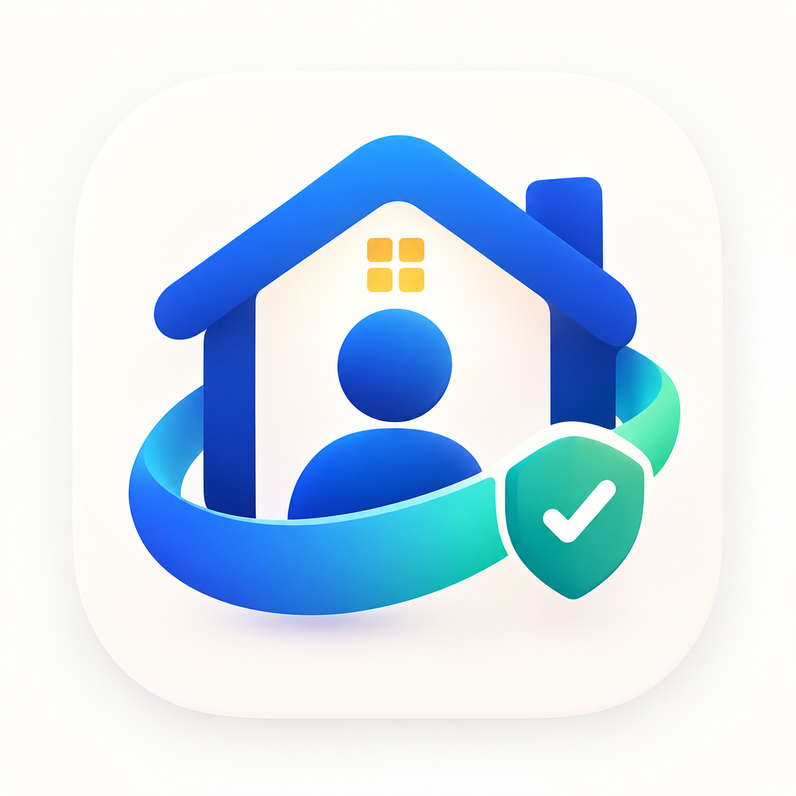
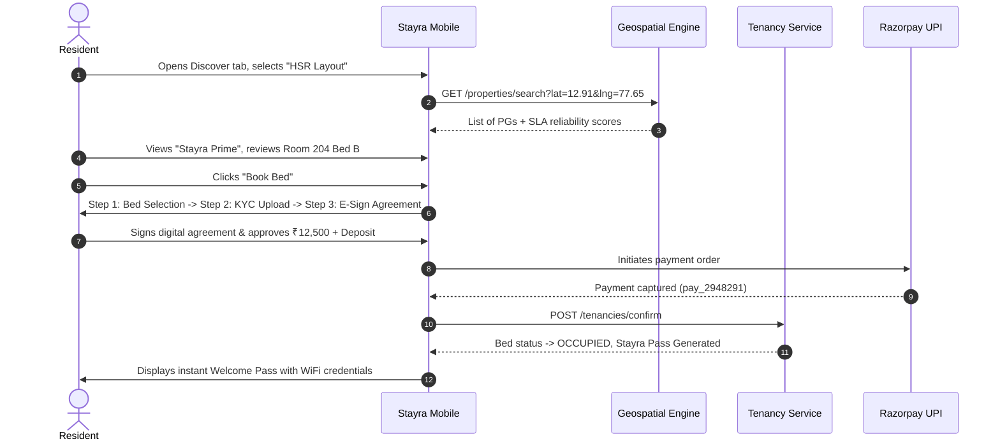
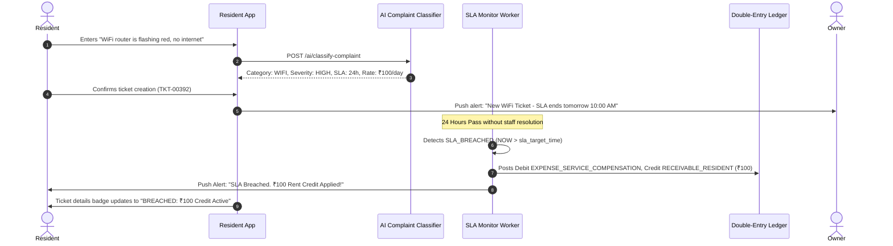

# Stayra — Complete Product UI/UX Design & System Specification

**Product Name:** Stayra  
**Tagline:** *Smart stays. Fair rent. Better living.*  
**Document Version:** 1.0.0  
**Status:** Canonical Design & Architecture Blueprint  
**Platforms:** Cross-Platform Mobile (iOS & Android via React Native Expo) & Responsive Web Portal  

---

## 1. Brand Identity & Visual Language

Stayra is positioned as a **premium, trustworthy, tech-forward living ecosystem** that bridges modern fintech precision with streamlined property operations and high-trust consumer marketplace experiences.

### 1.1 Brand Foundation & Canonical Icon

The visual language across the entire application and documentation is anchored exclusively in the official **Stayra brand icon/logo**:



> **Design Directive:** The colorful Stayra logo above is the sole canonical brand icon used throughout the app (splash, app launcher icon, headers, navigation, and identity passes). The monochrome/grey exploration assets are not used as the product icon.

#### Visual Symbolism:
1. **The Royal Blue House (`#1E5BF0`):** Represents structured, reliable, and premium accommodation. Modern architectural silhouette without frivolous ornament.
2. **The Glowing Amber Windows (`#F59E0B`):** Represents warmth, resident community, and high living comfort.
3. **The Tenant Silhouette:** Places the resident at the center of the living ecosystem rather than treating rooms as mere transactional real-estate inventory.
4. **The Dynamic Cyan-to-Emerald Swoosh (`#06B6D4` $\to$ `#10B981`):** Signifies continuous service continuity, clean living, and algorithmic speed.
5. **The Verified Shield with Checkmark (`#10B981`):** Represents the core promise: **Service-Level-Based Rent Compensation, guaranteed deposits, and zero hidden deductions.**

---

## 2. Design System Tokens

### 2.1 Color System

The color palette avoids generic web primaries in favor of curated HSL-tailored tones optimized for contrast, clarity, and dark/light mode balance:

| Token Name | Light Value | Dark Value | Semantic Purpose |
|---|---|---|---|
| `brand.primary` | `#1E5BF0` | `#3B82F6` | Primary CTAs, active highlights, key brand moments |
| `brand.primaryDark` | `#1648C7` | `#1D4ED8` | Pressed states, active borders |
| `brand.primaryLight` | `#EFF6FF` | `#1E293B` | Soft pill backgrounds, badge surfaces |
| `brand.accentShield` | `#10B981` | `#059669` | Trust badges, verified checkmarks, SLA compliance |
| `brand.accentCyan` | `#06B6D4` | `#0891B2` | Service highlights, gradient accents |
| `brand.warm` | `#F59E0B` | `#D97706` | Ratings, curfew alerts, urgent countdowns |
| `status.success` | `#10B981` | `#34D399` | Paid bills, resolved tickets, compliant SLAs |
| `status.warning` | `#F59E0B` | `#FBBF24` | SLA approaching (<2h), pending payments |
| `status.danger` | `#EF4444` | `#F87171` | SLA breached, overdue bills, critical hazards |
| `status.info` | `#0284C7` | `#38BDF8` | Informational announcements, noticeboard |
| `surface.canvas` | `#F8FAFC` | `#090D16` | App background, root screens |
| `surface.card` | `#FFFFFF` | `#111827` | Content cards, modals, sheets |
| `surface.secondary` | `#F1F5F9` | `#1E293B` | Input fills, subtle dividers, pill containers |
| `border.subtle` | `#E2E8F0` | `#1F2937` | Card borders, table dividers |
| `border.strong` | `#CBD5E1` | `#374151` | Focused inputs, active tabs |
| `text.primary` | `#0F172A` | `#F8FAFC` | Headings, high-emphasis text, numbers |
| `text.secondary` | `#475569` | `#94A3B8` | Body text, descriptions, inactive states |
| `text.muted` | `#94A3B8` | `#64748B` | Timestamps, placeholders, metadata |

### 2.2 Typography Hierarchy

We use a single, world-class modern sans-serif typeface: **Plus Jakarta Sans** (with fallback to Inter / system sans):

```typescript
export const typography = {
  display: { fontSize: 30, fontWeight: '800', lineHeight: 36, letterSpacing: -0.8 },
  h1: { fontSize: 24, fontWeight: '700', lineHeight: 30, letterSpacing: -0.5 },
  h2: { fontSize: 20, fontWeight: '700', lineHeight: 26, letterSpacing: -0.4 },
  h3: { fontSize: 17, fontWeight: '600', lineHeight: 22, letterSpacing: -0.2 },
  body: { fontSize: 15, fontWeight: '400', lineHeight: 22 },
  bodyMedium: { fontSize: 15, fontWeight: '500', lineHeight: 22 },
  bodyBold: { fontSize: 15, fontWeight: '600', lineHeight: 22 },
  bodySmall: { fontSize: 13, fontWeight: '400', lineHeight: 18 },
  caption: { fontSize: 12, fontWeight: '500', lineHeight: 16 },
  label: { fontSize: 11, fontWeight: '700', lineHeight: 14, letterSpacing: 0.6, textTransform: 'uppercase' },
  button: { fontSize: 15, fontWeight: '600', lineHeight: 20 },
  metric: { fontSize: 26, fontWeight: '800', lineHeight: 32, letterSpacing: -0.5 },
};
```

### 2.3 Strict Iconography Guidelines

1. **Zero Emojis Policy:** Emojis are strictly banned from all UI components (no 🏠, 📍, ⚡, 📶, ❄️, etc.).
2. **Standard Icon Library:** Standardized on `lucide-react-native` with 2px stroke width, consistent optical sizing (`16`, `18`, `20`, `24`), and matching colors to text hierarchy.

---

## 3. Product Map & Complete Screen Inventory

| Screen ID | File Route | Persona | Primary Objective | State Models Handled |
|---|---|---|---|---|
| **SCR-01** | `app/index.tsx` | All | Brand Splash, session restore & role redirection | Loading, Redirect |
| **SCR-02** | `app/(auth)/login.tsx` | All | Phone number auth with +91 format & validation | Initial, Error, Submitting |
| **SCR-03** | `app/(auth)/otp.tsx` | All | 6-digit OTP verification with 30s resend timer | Initial, Verifying, Shake Error |
| **SCR-04** | `app/(auth)/select-role.tsx` | All | Resident vs Owner onboarding & persona setting | Active Selection, Onboarded |
| **SCR-05** | `app/(resident)/index.tsx` | Resident | Discover PGs, search, geo-filters & Map/List toggle | Empty, Loading, Filtered, Map Pins |
| **SCR-06** | `app/(resident)/pg/[id].tsx` | Resident | PG Details, photos, reputation breakdown & SLA terms | Gallery, Menus, Rules, Bed Inventory |
| **SCR-07** | `app/(resident)/book/[id].tsx` | Resident | Multi-step booking, digital KYC upload, e-contract | Stepper: Bed $\to$ KYC $\to$ E-Sign $\to$ Pay |
| **SCR-08** | `app/(resident)/my-stay/index.tsx` | Resident | Current active stay, WiFi access, roommates, daily food | Active Tenancy, Noticeboard, Meals |
| **SCR-09** | `app/(resident)/my-stay/agreement.tsx` | Resident | Immutable digital tenancy agreement viewer | Signed PDF view, Clause details |
| **SCR-10** | `app/(resident)/my-stay/move-out.tsx` | Resident | 30-day notice trigger & deposit refund calculator | Notice form, Settlement breakdown |
| **SCR-11** | `app/(resident)/bills/index.tsx` | Resident | Monthly billing hub, SLA credits applied, Pay Rent CTA | Outstanding balance, History, Paid |
| **SCR-12** | `app/(resident)/bills/[id].tsx` | Resident | Itemized invoice breakdown with sub-meter proof | Subtotal, SLA credits, UPI Checkout |
| **SCR-13** | `app/(resident)/complaints/index.tsx` | Resident | Ticket dashboard with live SLA countdown badges | Active countdowns, Breached credits |
| **SCR-14** | `app/(resident)/complaints/new.tsx` | Resident | Raise ticket with category, AI classification & media | AI suggestion, Camera upload |
| **SCR-15** | `app/(resident)/complaints/[id].tsx` | Resident | Live ticket timeline, technician chat & micro-survey | Status stepper, ₹100 credit, Rating |
| **SCR-16** | `app/(resident)/profile/index.tsx` | Resident | Digital Stayra Resident ID pass & role switch | QR Pass, KYC status, Switch Role |
| **SCR-17** | `app/(owner)/index.tsx` | Owner | Portfolio executive KPI dashboard & urgent alerts | Occupancy, Revenue, Breaching SLAs |
| **SCR-18** | `app/(owner)/properties/index.tsx` | Owner | Multi-branch property list & occupancy stats | Property cards, Quick stats |
| **SCR-19** | `app/(owner)/properties/[id]/rooms.tsx` | Owner | Floor-by-floor interactive bed allocation matrix | Bed status grid, Resident details |
| **SCR-20** | `app/(owner)/billing/index.tsx` | Owner | Monthly bill batch generation & payment tracking | Unbilled tenancies, Collection stats |
| **SCR-21** | `app/(owner)/billing/record-meter.tsx`| Owner | Sub-meter recorder with AI Anomaly Detector alert | Unit input, Spike warning (+320%) |
| **SCR-22** | `app/(owner)/complaints/index.tsx` | Owner | Maintenance dispatch kanban by SLA urgency | Breaching Soon, Assign Staff |
| **SCR-23** | `app/(owner)/complaints/[id].tsx` | Owner | Assign technician & log photo resolution proof | Staff picker, Proof upload, Close |
| **SCR-24** | `app/(modals)/ai-assistant.tsx` | All | AI Copilot conversational drawer (Search & Analytics)| Prompt suggestions, Tool cards |
| **SCR-25** | `app/(modals)/notifications.tsx` | All | Real-time push notification feeds | Unread badges, Actionable alerts |

---

## 4. End-to-End User Journeys

### 4.1 Discovery & Tenancy Onboarding Journey


### 4.2 Maintenance & SLA Rent Compensation Journey


---

## 5. Architectural Alignment & Safety Rules

1. **Deterministic Financial Math:** Rent credits and move-out calculations are computed strictly using deterministic TypeScript engines (`calculateSlaCompensation`), never by LLM hallucinations.
2. **Persistent Stayra Resident ID:** All resident tenancies and ratings tie to `STR-RES-XXXXXX`, persisting across different PG owners while preserving tenant privacy boundaries.
3. **Double-Entry Balance Guarantee:** Rent receivable debits are balanced against revenue and compensation credits, ensuring ledger integrity.
4. **State Transitions & Edge Cases:** All forms enforce Zod validation schemas, inline field errors, loading spinners, empty-state recovery prompts, and idempotent submissions.
